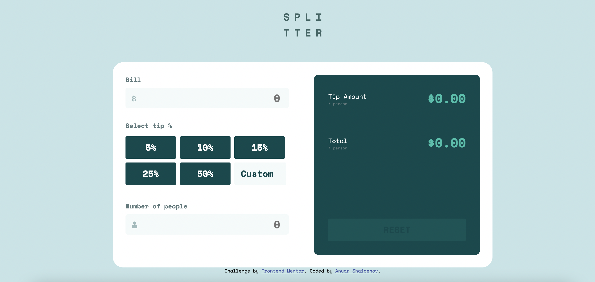

# Frontend Mentor - Tip calculator app solution

This is a solution to the [Tip calculator app challenge on Frontend Mentor](https://www.frontendmentor.io/challenges/tip-calculator-app-ugJNGbJUX). Frontend Mentor challenges help you improve your coding skills by building realistic projects.

## Table of contents

- [Overview](#overview)
  - [The challenge](#the-challenge)
  - [Screenshot](#screenshot)
  - [Links](#links)
- [My process](#my-process)
  - [Built with](#built-with)
  - [What I learned](#what-i-learned)
- [Author](#author)

## Overview

### The challenge

Users should be able to:

- View the optimal layout for the app depending on their device's screen size
- See hover states for all interactive elements on the page
- Calculate the correct tip and total cost of the bill per person

### Screenshot



### Links

- Solution URL: [Check out the solution](https://www.frontendmentor.io/solutions/tip-calculator-using-vanilla-js-and-sass-yuYA1F6me)
- Live Site URL: [Check out the live demo](https://anuarshaidenov.github.io/tip-calculator/)

## My process

### Built with

- Semantic HTML5 markup
- CSS custom properties
- Flexbox
- CSS Grid
- Mobile-first workflow
- Vanila JS

### What I learned

After this project I got one step ahead in mastering useful HTML and CSS tricks using flexbox and grid. I used Sass and some BEM notation. As always it was helpful throughout the process.

I figured out how to calculate the tip values with the following fomulas:

# total tip: bill \* percentage / 100

# tip per peson: total tip / number of people

I made use of call() function that was necessary for refactoring my code:

```js
[inputBill, inputCustomActive, inputNumberOfPeople].forEach((input) => {
  input.addEventListener("focus", function (e) {
    const value = e.target.value;
    isValueZero.call(this, value);
  });
```

To display the tip values as decimals I used the following math function:

```js
totalTip = (Math.round(((bill * tip) / 100) * 100) / 100).toFixed(2);
```

One of the trickiest parts of my html file was to figure out which tags I should use and think ahead so that I could incorporate JavaScript and CSS into my app. Here's an example of how I went about the tip buttons:

```html
<div class="group">
  <h3 class="label label--left">Select tip %</h3>
  <div class="tips">
    <button class="btn btn--tip">5%</button>
    <button class="btn btn--tip">10%</button>
    <button class="btn btn--tip">15%</button>
    <button class="btn btn--tip">25%</button>
    <button class="btn btn--tip">50%</button>
    <input
      type="number"
      min="0"
      name="tip"
      id="tip"
      class="btn btn--tip btn--custom"
      placeholder="Custom"
    />
  </div>
</div>
```

## Author

- Frontend Mentor - [@yourusername](https://www.frontendmentor.io/profile/anuarshaidenov)
- Instagram - [@044anuar](https://www.instagram.com/044anuar)
- Twitter - [@anuarnyi](https://www.twitter.com/anuarnyi)
